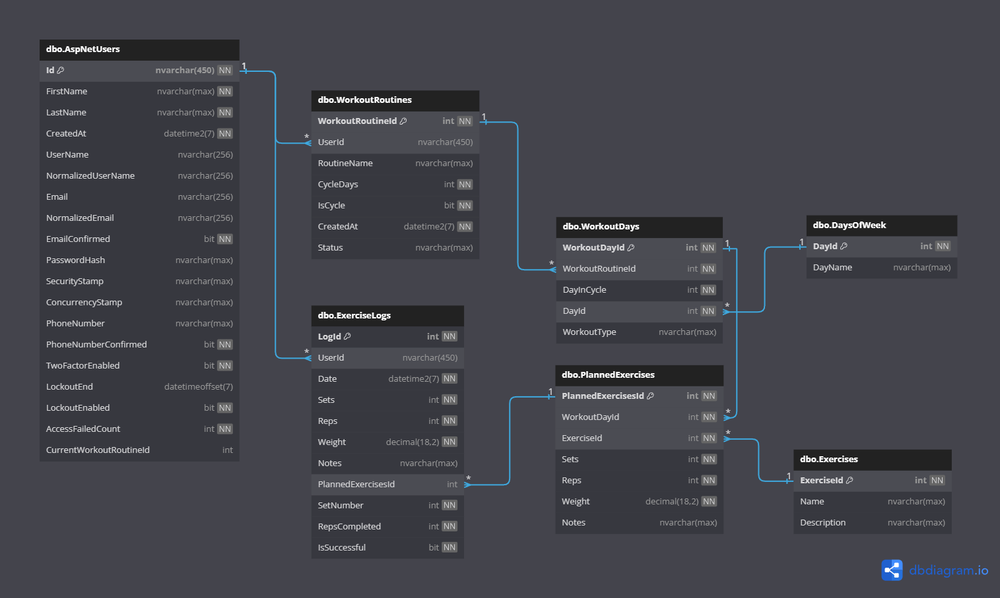

# GymQuest - ASP.NET Workout Tracker

## Overview
GymQuest is a full-featured workout tracking application built using ASP.NET Core MVC. It allows users to create workout routines, log exercises, and track their progress over time. Users can also dynamically add exercises to their routines and manage their daily workouts with ease. The application leverages an Azure SQL database to store workout data.

**Live Application:** <a href="https://gymquest.azurewebsites.net/" target="_blank">GymQuest - Azure Deployment</a>

## Features
- **User Registration and Authentication**: Users can sign up, log in, and manage their account.
- **Workout Routines**: Create, view, and manage workout routines.
- **Dynamic Exercise Management**: Add, edit, and delete exercises from routines, even during active workouts.
- **Progress Tracking**: Log completed exercises and view past workout data.
- **Azure SQL Integration**: Data persistence using a scalable Azure SQL Database.

## How to Use the Application

### 1. Register an Account
- Navigate to the **[GymQuest Registration Page](https://gymquest.azurewebsites.net/account/register)**.
- Fill in the required fields, then click the **Register** button.
- Once registered, you will be automatically logged in and redirected to the home page.

### 2. Logging In
- Visit the **[Login Page](https://gymquest.azurewebsites.net/account/login)**.
- Enter your email and password, then click **Login**.
- Upon successful login, you will be directed to your dashboard where you can manage your workouts.

### 3. Creating a Workout Routine
- After logging in, navigate to the **"Create Routine"** section from the dashboard.
- Enter the name of the workout routine.
- Add exercises by selecting them from the dropdown list, specifying sets, reps, and weights for each.
- Click **Save Routine** to store the routine.

### 4. Managing Workout Routines
- In your **Profile**, you can view your existing workout routines.
- To edit a routine, click **View Routine** and then click **Unlock** or **Remove** next to the exercise you want to modify. You can add, update, or remove exercises as needed.

### 5. Logging a Workout
- On the **Profile page**, find the workout routine you are performing today and click **View Routine**.
- Make any changes if desired and then click **Start Routine**.
- The app will display the exercises planned for the current day.
- As you complete each exercise, fill in the actual number of sets, reps, and weights, then click **Save Set**.
- The logged data will be stored for future progress tracking.

## Planned Features
### 1. Viewing Workout History
- View past workouts for each day, along with the number of sets, reps, and weights.
- Display progress over time to the user

### 2. Editing Your Profile
- Update profile information (password, email, etc.)

## Architecture & Design
### Architecture
- **Frontend**: ASP.NET Core MVC + Bootstrap for responsive UI
- **Backend**: ASP.NET Core, Entity Framework Core for data access
- **Database**: Azure SQL
- **Security**: ASP.NET Core Identity for authentication

### Entity-Relationship Diagram (ERD)

The database contains several key tables:
- `Users`: Stores user information.
- `WorkoutRoutines`: Stores routine metadata.
- `WorkoutDays`: Stores days associated with routines.
- `PlannedExercises`: Contains details of exercises planned for each day.

### Code Structure - MVC
- **Controllers**: Handles the logic for managing users, workouts, and exercises.
- **Models**: Defines the data structure and represents entities like users, workouts, and exercises.
- **Views**: Razor Views for rendering HTML pages to the user.

### Key Components
- **WorkoutController.cs**: Handles all actions related to workout routines and exercises.
- **WorkoutService.cs**: Contains business logic for managing workouts.
- **WorkoutRepository.cs**: Interacts with the Azure SQL database to retrieve and persist data.

## Code Snippet

### Example: Adding an Exercise to a Workout Day

```csharp
public async Task<IActionResult> AddExerciseToDay(int workoutRoutineId, string dayName, int exerciseId, int sets, int reps, decimal weight, string? notes)
{
    var workoutDay = await _workoutService.GetOrCreateWorkoutDayAsync(workoutRoutineId, dayName);
    if (workoutDay == null) return NotFound();

    var newExercise = new PlannedExercises
    {
        WorkoutDayId = workoutDay.WorkoutDayId,
        ExerciseId = exerciseId,
        Sets = sets,
        Reps = reps,
        Weight = weight,
        Notes = notes
    };

    await _workoutService.AddPlannedExerciseAsync(newExercise);
    return Ok(new { plannedExerciseId = newExercise.PlannedExercisesId });
}
```
